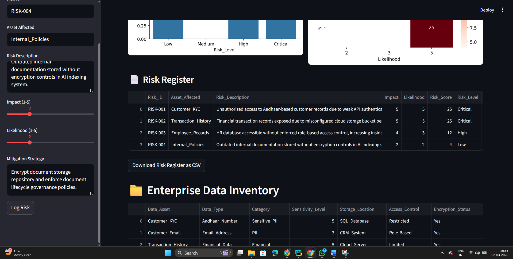
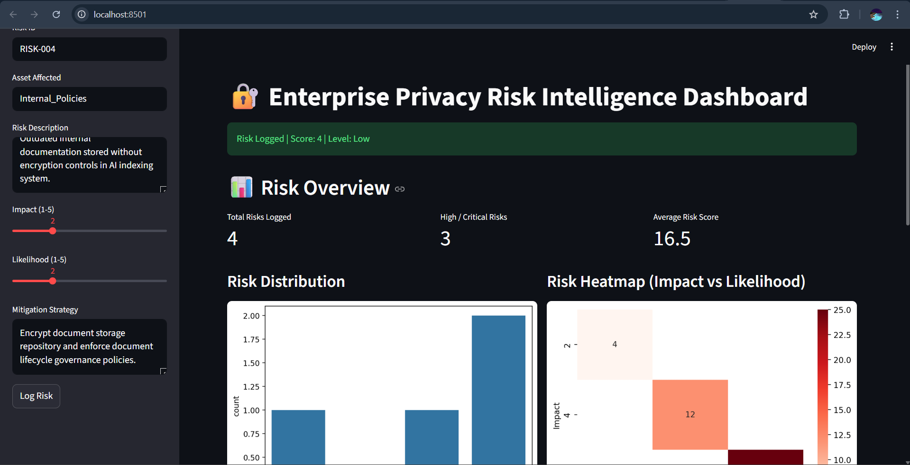
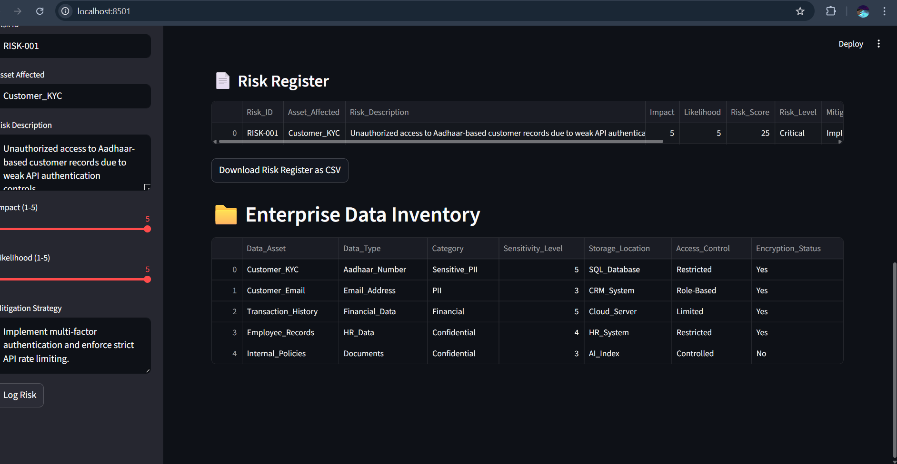

# 🔐 Enterprise Privacy Risk Intelligence Dashboard

Enterprise-grade privacy risk assessment simulation aligned with governance and compliance workflows.

---

## 📌 Problem Statement

Organizations handle sensitive PII, financial, and HR data but often lack structured visibility into privacy risks across assets.  
This project simulates an enterprise privacy governance workflow with quantitative risk scoring and executive visualization.

---

## 🚀 Key Features

- Structured Enterprise Data Inventory
- Impact × Likelihood Risk Scoring Model
- Automated Risk Classification (Low, High, Critical)
- Executive KPI Dashboard
- Risk Distribution Analytics
- Impact vs Likelihood Heatmap
- Downloadable Risk Register

---

## 📊 Dashboard Preview

### Risk Overview & Heatmap

---

### Risk Register

---

### Enterprise Data Inventory

---

## 🛠 Tech Stack

- Python
- Streamlit
- Pandas
- Matplotlib / Seaborn

---

## 🎯 Objective

To demonstrate structured risk quantification and governance automation for enterprise privacy environments.